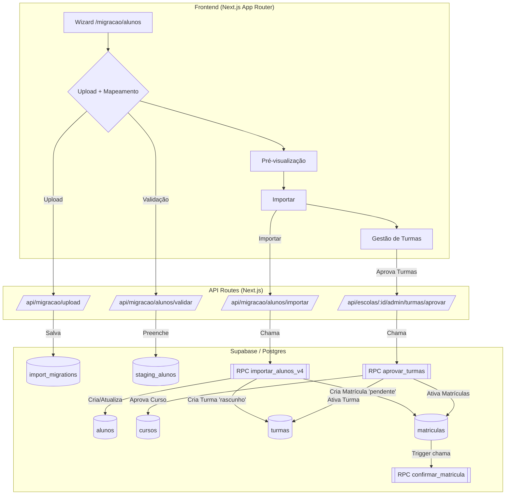

# 📘 Moxi Nexa — Módulo de Importação, Matrículas em Massa e Documentos Académicos

Este módulo implementa o **wizard completo de migração de alunos** e o **processo de matrícula em massa**, com um fluxo de aprovação que garante a integridade dos dados acadêmicos.

Toda a arquitetura foi projetada para:

- Minimizar intervenção manual com **criação e aprovação implícita de cursos e turmas**.
- Garantir consistência & auditabilidade através de um **workflow de aprovação em duas etapas (importação e ativação)**.
- Preservar dados históricos com o campo `numero_processo_legado`, que é indexado para busca rápida.
- Suportar alunos **sem `profile_id`** (opcional).
- Tratar o contexto financeiro da migração com o **"Escudo Financeiro"**, que evita cobranças retroativas.

---

## 🧩 Visão Geral da Arquitetura

⸻

## 1. Fluxo Completo de Importação e Ativação

O processo é dividido em duas grandes fases: **Importação** e **Aprovação**.

### Fase 1: Importação (Wizard de Migração)

O objetivo é trazer os dados da planilha para o sistema de forma segura, como um "rascunho".

📁 **Passo 1 — Upload e Mapeamento**
-   A secretária sobe a planilha CSV/Excel.
-   Mapeia as colunas do arquivo (ex: `NOME_COMPLETO` para `nome`).
-   Seleciona o **Modo de Importação**:
    -   **`migracao`**: Para alunos existentes. Cria alunos e matrículas pendentes.
    -   **`onboarding`**: Para novos candidatos. Apenas cria os registros dos alunos.
-   Define a **Data de Início Financeiro** (Escudo Financeiro).

🔍 **Passo 2 — Validação e Pré-visualização**
-   O sistema valida os dados e os insere na tabela `staging_alunos`.
-   Uma pré-visualização é exibida para confirmação.

🚀 **Passo 3 — Importação (Execução da `importar_alunos_v4`)**
-   Ao confirmar, a RPC `importar_alunos_v4` é executada.
-   **Deduplicação**: Procura por alunos existentes via `BI_NUMERO` ou `NOME_COMPLETO` + `DATA_NASCIMENTO`. Se encontra, atualiza; senão, cria um novo.
-   **Nº de Processo Legado**: O `NUMERO_PROCESSO` da planilha é salvo no campo `numero_processo_legado` para busca histórica. O `numero_processo` oficial é sempre gerado pelo sistema.
-   **Criação de Rascunhos**:
    -   O `TURMA_CODIGO` é lido. Se a turma não existe, ela é criada com `status_validacao = 'rascunho'`. O `curso_id` é preenchido se o curso já existir, senão fica `NULL`.
    -   A matrícula (`matriculas`) é criada com `status = 'pendente'`.

O resultado desta fase é que todos os alunos estão no sistema, mas as novas estruturas acadêmicas e matrículas ainda não são "oficiais".

### Fase 2: Aprovação e Ativação (Admin)

O objetivo é que um administrador valide as estruturas criadas e ative as matrículas.

⚙️ **Passo 4 — Aprovação na Gestão de Turmas**
-   O administrador vai para a página de **Gestão de Turmas**.
-   Ele vê uma lista de turmas com o status "Pendente" ou "Rascunho".
-   Ele seleciona as turmas que deseja aprovar e clica em **"Aprovar Selecionadas"**.

✨ **Passo 5 — A Mágica da Ativação (Execução da `aprovar_turmas`)**
-   A RPC `aprovar_turmas` é acionada e executa as seguintes ações em uma única transação:
    1.  **Materializa o Curso**: Para cada turma, ela lê o `turma_codigo`, infere o `curso_codigo`, e então cria o curso (com status `aprovado`) se ele não existir, ou o marca como `aprovado` se já existia como rascunho.
    2.  **Aprova a Turma**: Atualiza a turma, vinculando o `curso_id` correto e mudando seu `status_validacao` para `'aprovado'`.
    3.  **Ativa as Matrículas**: Encontra todas as matrículas `pendentes` associadas àquela turma e as atualiza para `status = 'ativa'`. Um gatilho então gera o `numero_matricula` oficial.

Neste ponto, o aluno está oficialmente matriculado, o curso e a turma são oficiais, e o aluno aparecerá nas pautas.

### Fase 3: Geração Financeira

-   Com as matrículas ativas, o "motor financeiro" (`gerar_mensalidades_lote`) pode ser executado.
-   Ele só irá gerar cobranças para as matrículas cuja `data_inicio_financeiro` seja anterior ou igual à data de vencimento da mensalidade a ser gerada, respeitando o **Escudo Financeiro**.

## 2. Estrutura SQL Chave

-   `public.alunos`: Agora com `numero_processo_legado` (pesquisável).
-   `public.cursos`: `status_aprovacao` (`rascunho` ou `aprovado`).
-   `public.turmas`: `status_validacao` (`rascunho` ou `ativo`).
-   `public.matriculas`: `status` (`pendente` ou `ativa`), `data_inicio_financeiro`.

## 3. Funções (RPCs) Principais

-   **`public.importar_alunos_v4`**: Orquestra a fase de importação e criação de rascunhos.
-   **`public.aprovar_turmas`**: Orquestra a fase de aprovação e ativação.

## 4. Modelo de Planilha Oficial (CSV)

A planilha **não precisa de uma coluna para o curso**. O `TURMA_CODIGO` é a única fonte de verdade.

| Coluna CSV          | Descrição                                         | Exemplo        |
| ------------------- | ------------------------------------------------- | -------------- |
| `NOME_COMPLETO`     | Nome completo do aluno.                           |                |
| `DATA_NASCIMENTO`   | Data de nascimento (vários formatos aceitos).     |                |
| `BI_NUMERO`         | **Recomendado**. Usado para evitar duplicatas.       |                |
| `NUMERO_PROCESSO`   | Opcional. Salvo como `numero_processo_legado`.     |                |
| `TURMA_CODIGO`      | **Obrigatório**. Estrutura: `CURSO-CLASSE-TURNO-LETRA`. | `TI-10-M-A`    |
| ...outros campos... | `GENERO`, `NIF`, contatos do encarregado, etc.    |                |