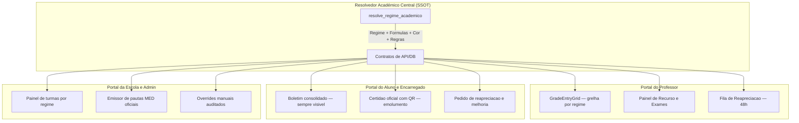

# KLASSE — Especificação de Product Design & UI/UX (Decreto Executivo n.º 04/2026)

**Documento relacionado:** `docs/SPRINT_RAA_DECRETO_EXECUTIVO_04_2026.md`
**Normativa legal:** Regulamento da Avaliação das Aprendizagens (RAA) — Decreto Executivo n.º 04/2026, de 5 de Março
**Revisão:** correção de conformidade com o texto do decreto (ver notas de revisão no fim de cada secção)

### Estado de implementação — 2026-08-15

O resolvedor de regime (`resolve_regime_academico`), a consulta contextual de elegibilidade do Professor e o contrato final de resultado (`resolve_estado_resultado`) já estão implementados e validados com vínculo real da Escola Klasse. A base pura de fórmulas (`raa-formulas.ts`) centraliza MAC, MT, MFD, MFC, arredondamento e cor; a pauta anual, os documentos oficiais e o Portal do Professor já usam `MAC + NPT`. A migration `20260815180000_raa_exam_mfd_ssot.sql` foi aplicada: o SSOT agora resolve sessões publicadas/encerradas, componentes completos, recurso/extraordinário e MFD ponderada. O Portal do Professor trata `pendente_formula` como estado explicável quando a sessão ou algum componente ainda falta. Valores históricos NPP continuam fora da fórmula oficial, apenas como compatibilidade de dados legados.

O painel contextual de risco RAA do Professor também está implementado em `GET /api/academico/raa/riscos`: lista somente alunos com pendência na turma/disciplina atual e abre a análise individual sem troca de contexto. O pedido formal de reapreciação possui API/UI contextual, persistência com RLS, motivo, idempotência, protocolo e prazo de 48 horas. A secretaria possui fila única em `/secretaria/raa/reapreciacoes`, e a decisão operacional usa o mesmo pedido através de `/api/academico/raa/reapreciacao/decisao`, com autorização para secretaria, direção, administração escolar e `admin_financeiro`. Os eventos `raa_indisciplina_eventos` possuem modelo, RLS, endpoint `GET/POST /api/academico/raa/indisciplina`, UI de registo e integração no resolvedor público como `reprovado_por_indisciplina`; a reapreciação académica não é aberta automaticamente para esse motivo.

O Portal do Aluno já consome o mesmo resolvedor através de `GET /api/aluno/home/raa-status` e apresenta um cartão de estado com motivo explícito, incluindo “Retido por indisciplina grave”, sem recalcular o resultado na interface.

O aluno também pode iniciar a reapreciação no próprio detalhe da disciplina pelo boletim. O fluxo usa `/api/aluno/raa/reapreciacao`, preserva turma/ano/disciplina, devolve protocolo e prazo e informa claramente quando o resultado não é elegível por indisciplina grave.

O backend e a UI de melhoria de nota estão implementados em `/api/aluno/raa/melhoria`: o boletim lista apenas sessões de recurso do contexto do aluno e aceita pedido somente com resultado aprovado resolvido, vinculando a nota anterior à sessão oficial.

A decisão global de progressão foi centralizada na função pura `resolveRaaProgression`, que recebe apenas estados disciplinares já resolvidos e o regime da etapa. Ela distingue transição sequencial, inscrição condicional, recurso, retenção por aproveitamento, faltas, indisciplina, pendência de dados e conclusão. A integração persistente com virada/rematrícula e com o estado global do aluno permanece como backlog da Sprint 2; nenhuma UI deve antecipar uma decisão enquanto essa integração não estiver concluída.

A política já pode ser configurada no painel unificado `/admin/configuracoes/avaliacao`, sem fluxo paralelo: o utilizador vê o estado da configuração, escolhe as duas regras de progressão, confirma em “Salvar Alterações” e recebe feedback do resultado. A primeira gravação cria a linha da escola em `configuracoes_pedagogicas`; enquanto isso não ocorrer, a API global mantém o estado bloqueado e explicável.

---

## Visão geral e princípios de design

Arquitetura de UI/UX para a implementação do RAA nos três portais centrais do KLASSE: **Portal do Professor**, **Portal do Aluno/Encarregado de Educação** e **Portal de Operações da Escola (Admin/Secretaria)**.

### Princípios invioláveis

1. **Resolvedor Académico Central (SSOT):** nenhuma interface calcula localmente regime de exame, elegibilidade, média ou cor de estado. As UIs só consomem `resolve_regime_academico(turma_id)` / `resolve_estado_resultado(aluno_id, disciplina_id)` e exibem o que vem resolvido — **incluindo a cor**, que nunca é um limiar numérico fixo na UI (ver correção abaixo).
2. **KLASSE Flow Design Tokens:** paleta corporativa (Esmeralda para aprovação/transição, Ouro para atenção/rascunho, Rose para retidos/risco, Slate para estrutura) usada na navegação e nos elementos de marca. Componentes de controlo usam ícones e cor sólida — sem emoji como substituto de badge de estado (ver correção abaixo).
3. **Cor regulamentar do art. 37.º do RAA:** azul para resultado positivo/aprovado, vermelho para negativo/retido/reprovado — a cor deriva do campo `positivo` já calculado pelo resolvedor (que por sua vez sabe se o nível é Primário, escala 1–10, corte em 5, ou Secundário, escala 0–20, corte em 10), nunca de um número hardcoded na UI.

---



---

## 1. Portal do Professor (`/professor/*`) — Sprint 4

### A. Diário de classe e grelha do RAA

- **Cabeçalho de regime, texto claro:**
  - 12.ª classe: `12.ª Classe — Exame Nacional · MFD = 0,5 × MT3 + 0,5 × Exame`
  - 6.ª classe: `6.ª Classe — Exame Nacional · MFD = 0,6 × MT3 + 0,4 × Exame`
  - Ambos os pesos vêm do resolvedor, nunca escritos fixos no componente — a 12.ª usa 0,5/0,5 e a 6.ª/9.ª/Módulo 3/2.º ano EJA usam 0,6/0,4 (Anexo III/4).

- **Escala por ciclo de aprendizagem (correção):** a escala qualitativa vs. combinada depende do **Ciclo de Aprendizagem** da classe (I/II Ciclo = qualitativa e descritiva; III Ciclo, que inclui a 6.ª classe = combinada qualitativa+quantitativa o ano inteiro), não do trimestre dentro do ano lectivo. A grelha não deve alternar formato entre T1/T2/T3 — o formato de célula é fixo para o ano lectivo daquela classe, determinado pelo ciclo de aprendizagem que o resolvedor devolve.

- **Colunas por regime:**
  - Componentes definidos no decreto: **MAC** (média das avaliações contínuas) e **NPT** (nota da prova trimestral) compõem a Média do Trimestre (MT). Qualquer componente adicional específico do currículo do KLASSE (ex.: uma nota de participação separada) precisa de nome e fórmula próprios documentados — não deve ser inserido como se fizesse parte da fórmula oficial do Anexo III, para não confundir o que é exigido por lei com o que é adicional do produto.
  - **Exame combinado:** quando o regime resolvido pede escrito+oral ou oral+prático, a coluna de exame subdivide-se com validação de que a combinação é uma das permitidas pelo art. 5.º/m.

- **Cor de resultado (art. 37.º):** `<NotaPill>` recebe o campo `positivo: boolean` do resolvedor e pinta azul/vermelho a partir dele. A UI não compara a nota a um número — o corte de "positivo" muda por nível de ensino (5 no Primário, 10 no Secundário) e isso já está resolvido no backend.

### B. Contingências, melhoria de nota e reapreciação (48h)

- **Painel de recurso e exame extraordinário:** tabela de alunos elegíveis, populada pelo motor de elegibilidade (não recalculada na tela).
- **Fila de reapreciação com contagem regressiva de 48h**, estado "expirado" desabilita a ação em vez de escondê-la.
- **Melhoria de nota:** aplica a regra da maior nota (`GREATEST`) sem apagar o histórico; limite de 3 disciplinas (Primário) / 5 (Secundário) desabilita o botão de novo pedido com a razão explicada, não como erro pós-submissão.

---

## 2. Portal do Aluno e Encarregado (`/aluno/*`) — Sprint 5

### A. Transparência académica (RDEC / RDEA / RDA)

- **Cartão de resultado final**, com o veredicto do resolvedor:
  - Transitou de ano
  - Admitido a exame de recurso (com as disciplinas)
  - Transitou com inscrição condicional (com as disciplinas pendentes e prazo do exame extraordinário)
  - Retido — **sempre com o motivo em uma frase ao lado do badge** (aproveitamento vs. assiduidade vs. indisciplina grave), nunca a etiqueta sozinha.
- **Boletim e pauta digital consolidada: sempre visíveis, sem paywall.** O art. 6.º/1-j obriga a escola a fornecer ao encarregado elementos de acompanhamento do processo de aprendizagem, e o art. 4.º/g eleva transparência a princípio orientador do RAA. Gatilhos de monetização não devem incidir sobre a visualização de notas.
- **Certidão oficial com QR code de autenticidade:** este sim é o ponto de monetização legítimo — documento formal de conclusão (art. 40.º) associado ao emolumento na secretaria. Banner de conversão fica restrito a este documento, nunca ao boletim de notas:
  > **Certidão Oficial da 12.ª Classe disponível.** Regularize o emolumento na Secretaria Digital para emitir a certidão em PDF com QR code de autenticidade.

### B. Auto-serviço de reapreciação e melhoria de nota

- Mesmo componente de prazo (48h) e de limite de disciplinas usado no portal do professor, com linguagem ajustada ao encarregado.

---

## 3. Portal da Escola e Admin (`/operacoes/*` / `/admin/*`) — Sprint 7

### A. Painel de turmas por regime

- Distribuição de turmas pelas 5 classes de exame (6.ª, 9.ª, 12.ª, Módulo 3, 2.º ano EJA) e classes de transição — lido do resolvedor.
- **Overrides manuais:** exigem justificativa obrigatória, com utilizador, data e motivo registados — sempre visíveis no painel, nunca silenciosos.

### B. Emissão de pautas e certidões oficiais

- Geração de pautas finais (Época Normal, Recurso, Exame Extraordinário) em PDF, seguindo o layout dos Anexos IV–VII, com cor azul/vermelha derivada do campo `positivo` do resolvedor.
- Liberação da **certidão oficial** (não do boletim) condicionada ao pagamento do emolumento, integrada com a tesouraria.

---

## Validação e engenharia de interface

- Componentes reutilizados do `KLASSE Flow` (`AlunoCard`, `NotaPill`, `RegimeBadge`, `PrazoTimer`).
- Nenhum componente de estado de resultado usa emoji como substituto de cor/ícone — emoji fica reservado a comunicação informal (notificações, e-mails), nunca a pautas ou boletins oficiais.
- Checagem de tipos e diff:
  ```bash
  pnpm -C apps/web exec tsc --noEmit
  git diff --check
  ```

---

## Notas de revisão (o que mudou em relação à versão anterior)

1. Cor azul/vermelha deixa de usar limiar fixo `≥10,0` — passa a usar o campo `positivo` resolvido por nível de ensino (corte 5 no Primário, 10 no Secundário).
2. Removida a categoria "Exame Provincial" para a 6.ª classe — o decreto só prevê Exame Nacional para 6.ª, 9.ª e 12.ª.
3. Corrigida a regra de escala: é por Ciclo de Aprendizagem (plurianual), não por trimestre dentro do mesmo ano lectivo.
4. Campo "NPP" removido por não estar definido no decreto; qualquer componente adicional do currículo do KLASSE deve ser documentado à parte da fórmula oficial.
5. Boletim de notas deixa de ficar atrás de paywall — só a certidão oficial com QR code é condicionada ao emolumento, para não conflitar com a obrigação de transparência dos arts. 4.º/g e 6.º/1-j.
