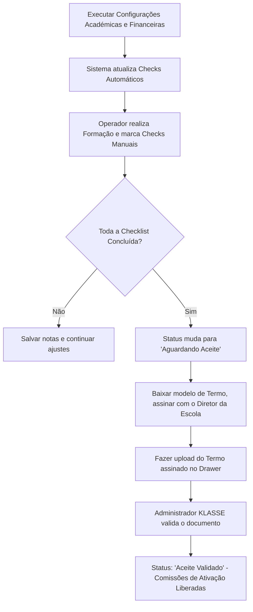

# SOP-CRM-06: Gestão Consolidada de Escolas (Painel Escolas 360)

Versão: 1.0.0
Data base: 2026-07-03
Escopo: Equipa operacional e comercial do parceiro (Operadores e Administradores)
Tabela Relacionada: `public.onboarding_requests`, `public.escola_users`, `public.turmas`, `public.matriculas`, `public.financeiro_tabelas`

---

## 1. Objetivo do Painel Escolas 360

O painel **Escolas 360** centraliza a gestão de todo o portfólio de colégios do parceiro comercial. Ele elimina a visualização isolada e une em uma única linha o estado de vendas (CRM Leads), ativação (Onboarding Steps), suporte técnico (Support Tickets) e ganhos (Comissões). 

Sua principal finalidade é garantir que a implantação seja **real e mensurável**, evitando o avanço de escolas sem a devida configuração acadêmica e financeira.

---

## 2. Quando usar o Escolas 360?

Este painel é de uso obrigatório nas seguintes situações:
1.  **Abertura de Turno (Diário):** Para rastrear escolas classificadas com **Risco Alto** ou **Atenção** (SLAs de suporte estourados ou atrasos operacionais).
2.  **Preparação de Reunião de Alinhamento:** Antes de contatar a diretoria de um colégio, o operador deve abrir a visão 360 para saber exatamente quais etapas acadêmicas estão travadas.
3.  **Auditoria de Entrega Técnica:** Para validar se o colégio está pronto para a emissão e assinatura do **Termo de Aceite de Implantação**.
4.  **Acompanhamento de Metas de Equipa:** Para o administrador comercial do parceiro delegar e redistribuir escolas entre os operadores locais.

---

## 3. Como funciona a Auditoria de Implantação (Checks Reais)

O checklist de implantação técnica exibido no Drawer de Detalhes da Escola não é editável de forma livre. O sistema realiza consultas automáticas no banco de dados da escola para certificar a entrega:

| Código do Check | Descrição no Painel | Tipo | Como o Sistema Valida (Banco de Dados) |
|---|---|---|---|
| `acesso_colaboradores` | Primeiro acesso da equipa administrativa | **Automático** | Verifica se existe pelo menos um perfil cadastrado nas roles `secretaria`, `financeiro`, `secretaria_financeiro` ou `admin_financeiro`. |
| `curriculo_configurado` | Currículo acadêmico configurado | **Automático** | Verifica se há pelo menos um currículo publicado (`status = 'published'`) na tabela `curso_curriculos`. |
| `turmas_criadas` | Turmas geradas e organizadas | **Automático** | Verifica se existem turmas criadas na tabela `turmas`. |
| `disciplinas_configuradas` | Disciplinas e pautas configuradas | **Automático** | Verifica se há disciplinas ativas associadas às turmas em `turma_disciplinas`. |
| `alunos_importados` | Alunos importados e matriculados | **Automático** | Verifica se há pelo menos uma matrícula ativa ou criada na tabela `matriculas`. |
| `financeiro_configurado` | Preçário e contas financeiras configurados | **Automático** | Verifica se as regras de mensalidades e preços foram parametrizadas na tabela `financeiro_tabelas`. |
| `formacao_secretaria_concluida` | Formação da secretaria concluída | **Manual** | Marcado pelo operador após realizar o treinamento prático dos secretários no uso de matrículas e faturamento. |
| `formacao_docentes_concluida` | Formação dos docentes concluída | **Manual** | Marcado pelo operador após capacitar os professores a lançarem notas/presenças no Portal do Professor. |
| `sistema_em_operacao` | Sistema em operação e homologado | **Manual** | Marcado de forma conjunta após o go-live e o primeiro dia de uso real sem bloqueios. |

*Nota: Os itens automáticos exibem o selo **"Sistema"** na cor verde e não podem ser alterados pelo operador. Eles atualizam-se sozinhos no momento em que as configurações reais são feitas.*

---

## 4. Matriz de Análise de Risco Operacional

O painel classifica as escolas em três níveis de risco usando algoritmos internos:

### A. Risco Alto (Cor: Vermelha)
*   **Critério:** Escolas com tickets de suporte urgentes fora do SLA de atendimento ou com etapas do roteiro de ativação vencidas há mais de 5 dias.
*   **Ação do Operador:** Abrir o ticket de suporte imediatamente, acionar o canal direto com o suporte KLASSE e ligar para o ponto de contato do colégio para alinhar uma solução.

### B. Atenção (Cor: Amarela)
*   **Critério:** Algum ticket de suporte em aberto próximo do limite do SLA ou com uploads rejeitados na triagem de planilhas.
*   **Ação do Operador:** Ajudar o cliente na correção da planilha rejeitada ou orientar a equipe administrativa da escola na resolução da dúvida do suporte.

### C. Controlado (Cor: Verde)
*   **Critério:** Cronograma de onboarding dentro do prazo e nenhum ticket de suporte crítico pendente de resposta.
*   **Ação do Operador:** Monitoramento de rotina e follow-up padrão semanal.

---

## 5. Fluxo de Encerramento e Assinatura do Termo de Aceite

O Termo de Aceite é o documento que atesta a entrega total da implantação técnica, destrava a fatura da escola e libera o repasse de comissões do parceiro comercial.

1.  Quando a checklist atinge **100% de conclusão** (todos os 9 itens com check), o status de implantação da escola é promovido automaticamente de `implantacao_em_andamento` para `aguardando_aceite`.
2.  O operador deve descarregar o modelo padrão de Termo de Aceite, colher a assinatura e carimbo do Diretor Geral da escola.
3.  Preencher no Drawer os dados do signatário (Nome completo, Cargo e Data de assinatura), anexar o ficheiro PDF ou imagem e clicar em **"Submeter e Validar Termo de Aceite"**.
4.  Após a validação da KLASSE, o status é alterado para `aceite_validado` e o processo financeiro é concluído com sucesso.
