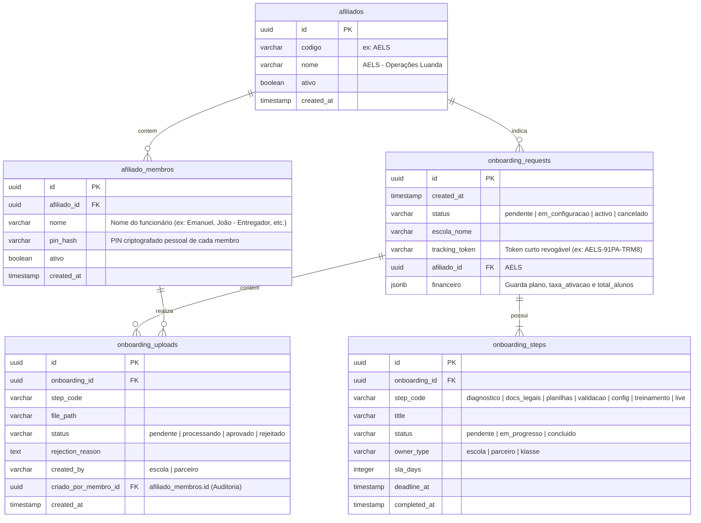

# Plano de Execução: CRM e Portal de Ativação Classe (For Net & Emanuel Caetano)

Este plano descreve a arquitetura relacional e o roteiro de desenvolvimento para o CRM de operações do escritório de **Emanuel Caetano (AELS)** e a interface de ativação colaborativa das **Escolas**, gerenciadas de forma centralizada por você como **Super Admin (For Net)**.

## Estado V1

Última validação live DB: 2026-06-28

Referências de acompanhamento:

- Cobertura actual: [plan_crm_execution_status.md](/Users/gundja/moxi-edtech/plan_crm_execution_status.md:1)
- Backlog técnico priorizado: [plan_crm_execution_backlog.md](/Users/gundja/moxi-edtech/plan_crm_execution_backlog.md:1)

Resumo da V1 já implementada:

- `tracking_token`, `onboarding_steps`, `onboarding_uploads` e bucket `onboarding`
- tracking público endurecido por RPC dedicada
- upload público por token via RPC dedicada
- fila de uploads no Super Admin com aprovação/rejeição
- provisionamento de escola existente
- criação + provisionamento em uma única chamada
- guardrails transacionais e audit log no provisionamento
- bloqueio visual do provisionamento quando ainda há etapas pendentes
- filtro de escolas elegíveis no modal de vinculação
- conversão formal `crm_lead -> onboarding_request`
- ledger de comissão recorrente do parceiro (`partner_commissions`)

Pendências principais para aderir ao plano completo:

- unificar o funil ponta a ponta entre marketing, CRM, onboarding, escola, assinatura e comissão
- criar cockpit administrativo de comissão (aprovação, bloqueio, pagamento e recibo)
- explicitar trial comercial K12 dentro do funil principal
- criar fila/tarefas persistidas de follow-up comercial
- criar variante “escola pública” sem financeiro transacional
- integrar canal WhatsApp rastreável no CRM comercial do parceiro

---

## 💾 1. Modelagem e Arquitetura de Dados

Para garantir a escalabilidade para 100 ou 1000+ escolas, viabilizar relatórios operacionais (ex: gargalos de tempo por etapa) e auditar individualmente as ações de cada membro da equipe do parceiro, estruturamos o banco de dados da seguinte forma:

---

## 👥 2. Como as 3 Frentes são Tratadas no Sistema

O plano trata as frentes de maneira isolada e integrada, garantindo privacidade, agilidade e controle:

### 🏢 Frente 1: O Escritório (Emanuel Caetano / AELS - Parceiro Comercial com Controle de Equipe)
*   **Login Individualizado (Sem compartilhamento de PIN):** O funcionário digita o código `AELS`. O painel Next.js consulta os membros cadastrados na tabela `afiliado_membros` e exibe uma lista de seleção (ex: *Emanuel Caetano*, *Especialista de Marketing*, *Entregador*). O usuário seleciona seu nome e insere seu **PIN pessoal** para entrar.
*   **Acompanhamento Comercial:** Visualizam a lista de escolas indicadas com status dos SLAs.
*   **Conversão Comercial:** O lead ganho pode ser convertido formalmente para `onboarding_request`, com geração de `tracking_token` e rastreabilidade no funil.
*   **Painel Financeiro:** O sistema já mantém ledger de comissão recorrente; o que falta é a operação administrativa completa de payout.
*   **Rastreabilidade Operacional:** Cada upload feito pelo escritório armazena o `criado_por_membro_id` do agente que enviou o arquivo em `onboarding_uploads`, garantindo que você e a direção do escritório saibam exatamente quem realizou cada tarefa.

### 🏫 Frente 2: A Escola (Cliente / Direção Escolar)
*   **Acesso Simplificado:** Entram em `/onboarding/acompanhar/[token]` usando o token de rastreamento (ex: `AELS-91PA-TRM8`) sem precisar criar logins administrativos no início.
*   **Transparência de Etapas:** Visualizam a linha do tempo com prazos e o responsável por cada fase (`owner_type`).
*   **Ações:** Baixam planilhas modelos e fazem o upload diretamente pelo portal.

### 👑 Frente 3: Você (Super Admin / For Net)
*   **Controle e Fila de Validação:** Visualiza em `/super-admin/onboarding` a fila de uploads com o nome de quem submeteu (seja a escola ou o membro do parceiro, ex: *Enviado por João (AELS)*). Aprovando o arquivo, a etapa correspondente é dada como concluída.
*   **Provisionamento Automático:** Com todas as etapas concluídas, o sistema executa a rota `/api/super-admin/onboarding/[id]/provision` para provisionar a escola em produção com um único clique.

---

## ⚖️ 3. Delegação de Ações e Desoneração do Super Admin

Para evitar sobrecarregar o **Super Admin** com tarefas administrativas manuais e permitir que foque no desenvolvimento core do produto, o sistema delega a maior parte da validação operacional ao **Escritório do Parceiro (AELS)**:

### 📥 3.1 Moderação Compartilhada de Arquivos (`onboarding_uploads`)
*   **Validação Administrativa (Parceiro AELS):**
    *   Documentos operacionais como **NIF (Cartão de Contribuinte)**, **Regulamento Interno Escolar**, **Logotipo da Escola** e **Contratos assinados** são validados e aprovados diretamente pelo escritório da AELS no seu portal de CRM (`/influencers/[codigo]`).
    *   *Benefício:* Reduz filas de espera e desonera o Super Admin de revisões puramente visuais e administrativas.
*   **Validação Técnica (Super Admin - For Net):**
    *   Apenas a **Planilha de Importação de Alunos/Professores** exige aprovação técnica do Super Admin, devido à necessidade de rodar os scripts de carga no banco de dados.

### 🔍 3.2 Pré-Validação de Planilhas (Filtro de Ruído)
*   Para evitar que planilhas com colunas erradas ou dados inválidos cheguem à fila técnica, a equipe do parceiro realiza uma **pré-validação**. 
*   A AELS verifica os dados e, após checar, marca o arquivo no CRM como *"Pronto para Importação"*. Só então ele entra na fila do Super Admin, reduzindo erros de processamento.

### ⏱️ 3.3 Gestão de Prazos e Prorrogações de SLA
*   A AELS tem autonomia no CRM para **prorrogar o SLA** de uma etapa caso a escola solicite mais prazo (ex: conceder mais 3 dias para coletar o NIF), registrando a justificativa de forma automatizada nos logs de auditoria sem precisar de intervenção técnica na base de dados.

### 🔑 3.4 Geração de Ambientes de Treinamento
*   Para os treinamentos presenciais (Fase 6), o portal da AELS permite **"Gerar Ambiente de Demonstração"** com um clique, criando acessos temporários para simulações de matrícula e teste no banco de dados automaticamente, desonerando o Super Admin dessa tarefa.

---

## 🤝 4. Fluxo de Ativação e SLAs Tripartites

O workflow de ativação escolar é composto por 7 fases síncronas, cada uma com prazo (SLA) e responsável explícito:

| Fase | Etapa / Código do Passo | Descrição | Responsável (`owner_type`) | SLA (Prazos) |
| :--- | :--- | :--- | :--- | :--- |
| **1** | `diagnostico` | Preenchimento do formulário inicial de diagnóstico escolar | **Parceiro** (Emanuel Caetano) | 3 dias |
| **2** | `docs_legais` | Envio de documentos legais (NIF, Regulamento, Contrato assinado) | **Escola** (Cliente) | 3 dias |
| **3** | `planilhas` | Upload da planilha preenchida de alunos/professores | **Escola** / **Parceiro** | 5 dias |
| **4** | `validacao` | Validação técnica de dados e script de importação técnica | **Classe** (Super Admin) | 2 dias |
| **5** | `config` | Configuração de turmas, salas, turnos e propinas no portal | **Parceiro** (Emanuel Caetano) | 2 dias |
| **6** | `treinamento` | Treinamento presencial/remoto da secretaria e direção | **Parceiro** (Emanuel Caetano) | 3 dias |
| **7** | `live` | Abertura oficial das matrículas online e sistema live | **Classe** (Super Admin) | 1 dia |

---

## 🚀 5. Roteiro de Implementação Técnico

### ➡️ Fase 1: Banco de Dados e Migrações (Supabase) — **BASE V1 ENTREGUE / EXPANSÃO PENDENTE**
1.  `tracking_token`, `onboarding_steps`, `onboarding_uploads` e bucket `onboarding` já existem.
2.  `afiliado_membros` e a autoria por membro em `onboarding_uploads` já foram implementados; a evolução corrente é expandir a governança operacional e a homologação final do fluxo do parceiro.
3.  O workflow de 7 etapas já foi aplicado e o modelo agora também registra `started_at` para medir o tempo real de cada fase.
4.  A ligação explícita `crm_leads <-> onboarding_requests` já foi aplicada no live DB.
5.  A tabela `partner_commissions` e as funções de geração/consulta de comissão já foram aplicadas no live DB.

### ➡️ Fase 2: APIs de Back-End (Next.js) — **V1 OPERACIONAL / EXPANSÃO COMERCIAL PENDENTE**
1.  **API do Cliente:** `/api/onboarding/acompanhar/[token]` já entrega checklist e status.
2.  **API de Login de Membros:** já existe listagem pública de membros e validação por `member_id + PIN`.
3.  **API de Upload Staging:** `/api/onboarding/[token]/upload` já aceita contexto de membro e limpa ficheiros órfãos quando a persistência falha.
4.  **APIs de Provisionamento:** os fluxos `/api/super-admin/onboarding/[id]/provision` e `/api/super-admin/onboarding/[id]/create-and-provision` já estão implementados.
5.  **Cron de SLA:** já existe verificação automática com cooldown por etapa e registo manual de `ligação realizada`.
6.  **Conversão CRM → Onboarding:** `/api/influencers/[codigo]/crm/leads/[leadId]/convert` já existe.
7.  **Comissões do Parceiro:** a leitura de comissões e a geração por confirmação de pagamento já existem.

### ➡️ Fase 3: Interfaces do Usuário (Front-End) — **V1 OPERACIONAL / AJUSTES PENDENTES**
1.  **Página da Escola:** `/onboarding/acompanhar/[token]` já cobre 7 etapas, uploads e download de materiais de apoio.
2.  **Portal do Parceiro:** `/influencers/[codigo]` já opera com login por membro, CRM pré-vendas, conversão para onboarding, dashboard de SLA e materiais.
3.  **Dashboard Super Admin:** a moderação de uploads, autoria detalhada, relatórios operacionais e provisionamento já estão activos.
4.  **Pendência actual:** o follow-up manual já pode ser registado no portal do parceiro por escola e por etapa.
5.  **Pendências reais de UI:** cockpit de comissão, visão unificada do funil, trial K12 explícito e tarefas comerciais persistidas.
